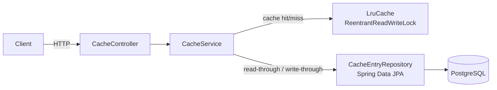

# Concurrent LRU Cache

A thread-safe, in-memory LRU cache backed by PostgreSQL, built in Java/Spring Boot. Deployed as a containerized, multi-service application on Kubernetes.

## What this demonstrates

- Manual LRU implementation (doubly-linked list + hash map), not `LinkedHashMap`
- Correct use of `ReentrantReadWriteLock` for a data structure where "reads" secretly mutate shared state
- A reproducible concurrency bug — caught with a targeted load test — fixed, and re-verified
- Read-through / write-through caching in front of a real database
- Multi-container Docker networking
- Stateful Kubernetes deployment with persistent storage, verified by deliberately destroying a pod

## Architecture



**Request flow:**
- `get(key)`: check in-memory cache first. Hit → return immediately. Miss → query Postgres, populate cache, return.
- `put(key, value)`: write to Postgres (source of truth), then update the in-memory cache.

## Why the locking works the way it does

`ConcurrentHashMap` alone isn't sufficient here: it protects the map's key→value structure, but the LRU eviction order lives in a separate doubly-linked list. Critically, `get()` isn't a pure read — it calls `moveToFront()`, which mutates shared pointers. Both `get()` and `put()` therefore acquire the **write** lock. This was verified empirically: an early version using no locking crashed under a concurrent load test (`NullPointerException` from corrupted pointers); after adding `ReentrantReadWriteLock`, the same test passes consistently.

**Known tradeoff:** since every operation takes the write lock, reads fully serialize — the implementation is correct and simple, but doesn't exploit `ReentrantReadWriteLock`'s concurrent-read capability. A production version might use a separate, finer-grained lock for list operations.

## Tech stack

Java 17 · Spring Boot 4 · Spring Data JPA · PostgreSQL 16 · Docker · Kubernetes (`kind`)

## API

| Method | Endpoint | Description |
|---|---|---|
| `GET` | `/cache/{key}` | Fetch value, `404` if not found |
| `PUT` | `/cache/{key}` | Store value (body: plain text) |

## Running locally

**Plain Spring Boot:**
```bash
docker run -d --name cache-postgres \
  -e POSTGRES_USER=cacheuser -e POSTGRES_PASSWORD=cachepass -e POSTGRES_DB=cachedb \
  -p 5432:5432 postgres:16
./mvnw spring-boot:run
```

**Docker (app + Postgres as separate containers):**
```bash
docker network create cache-net
docker run -d --name cache-postgres --network cache-net \
  -e POSTGRES_USER=cacheuser -e POSTGRES_PASSWORD=cachepass -e POSTGRES_DB=cachedb \
  -p 5432:5432 postgres:16
docker build -t concurrent-lru-cache .
docker run -d --name cache-app --network cache-net \
  -e DB_HOST=cache-postgres -p 8080:8080 concurrent-lru-cache
```

**Kubernetes (via `kind`):**
```bash
kind create cluster --name lru-cache-cluster
kind load docker-image concurrent-lru-cache --name lru-cache-cluster
kubectl apply -f k8s/postgres.yaml
kubectl apply -f k8s/app.yaml
kubectl port-forward service/cache-app 8080:8080
```

## Testing

```bash
./mvnw test
```

Includes a single-threaded eviction-correctness test and a concurrent load test (20 threads × 2,000 operations on overlapping keys) that verifies map/list consistency post-run.
